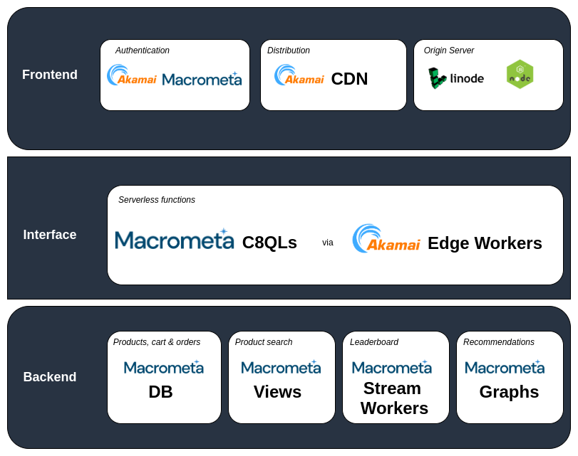
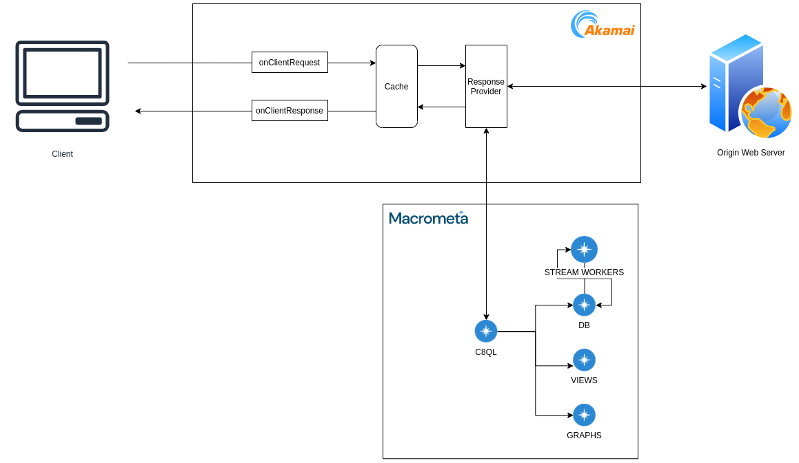
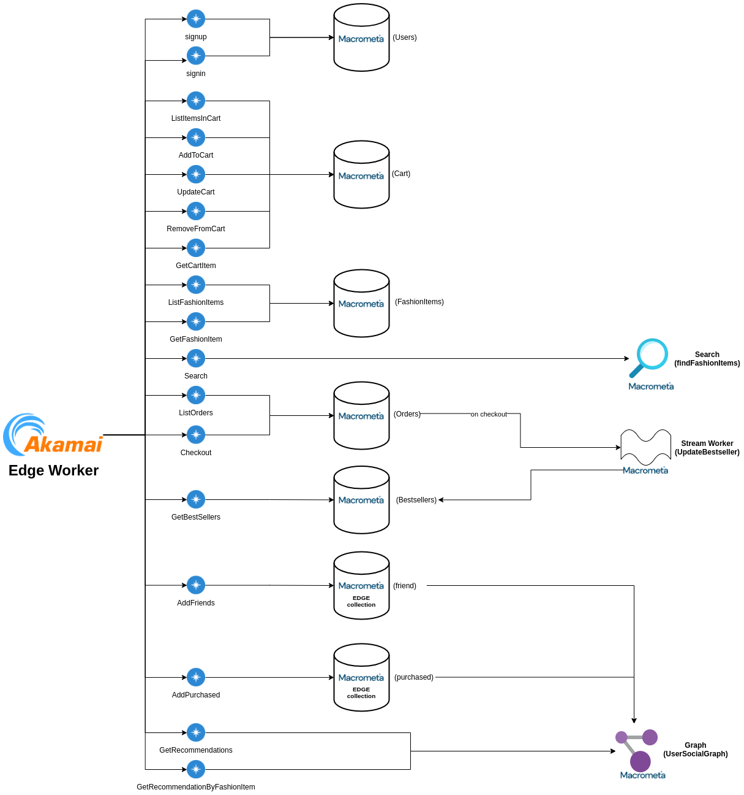

# E-Commerce using Macrometa GDN & Akamai EdgeWorkers

**Live Demo: http://fashionstore.demo.macrometa.io/**

Macrometa-Akamai Fashionstore Demo App is a full-stack e-commerce web application that creates a storefront (and backend) for customers to shop for "fictitious" fashion clothing & accessories called Edge & M.


Originally based on the AWS bookstore template app (https://github.com/aws-samples/aws-bookstore-demo-app), this demo replaces all AWS services like below

-   AWS DynamoDB,
-   AWS Neptune (Graphs),
-   AWS ElasticSearch (Search),
-   AWS Lambda
-   AWS Kinesis

This demo uses Macrometa's geo distributed data platform which provides a `K/V store`, `DynamoDB compatible document database`, `graph database`, `streams` and `stream processing` along with Akamai `edgeworkers` for the globally distributed functions as a service.

Unlike typical cloud platforms like AWS, where the backend stack runs in a single region, Macrometa and Akamai let you build `stateful distributed microservices that run in 100s of regions around the world concurrently`. The application logic runs in akamai's low latency function as a service runtime on akamai PoPs and make stateful data requests to the closest Macrometa region. End to end latency for `P90 is < 55ms` from almost everywhere in the world.

As a user of the demo, you can browse and search for fashion clothing & accessories, look at recommendations and best sellers, manage your cart, checkout, view your orders, and more.

## GDN Tenant Account

| **Federation**                                        | **Fabric** | **Email**                 |
| ----------------------------------------------------- | ------------------------- | ------------- |
| [Play](https://play.macrometa.io/) | fashion_store | demo@macrometa.io |

## Architecture



## Data & Control Flows



## Details

### Frontend

-   Frontend is a Reactjs application which is hosted on an external server. (Nodejs in our case. You can use something else too).
-   This acts as an Origin server for Akamai CDN and needs to be configured as such as an Akamai property.
-   Akamai CDN is used to cache static assets.

### Backend

The core of backend infrastructure consists of Macrometa Document store(DB), Macrometa Edge store(DB), Macrometa Views(search), Macrometa Stream Workers, Macrometa Graphs and Akamai Edge workers. Akamai Edge workers issue C8QLs to talk with the GDN network.

The application leverages Macrometa GDN document store to store all the data for fashion items, orders, the checkout cart and users. When new purchases or new users are added the corresponding Macrometa Edge collection is also updated. These Edge collections along with Document collection acting as vertices are used by the Macrometa Graphs to generate recommendations for the users. When new purchases are added Macrometa Stream Workers also update the BestSellers Collection store in realtime from which the best sellers leaderboard is generated.



## API Details

Below are the list of APIs being used.

> Currently Edge Workers do not support `PUT, POST, DELETE` calls. So frontend utilizes API params to model below APIs while calling the edgeworker. The edge worker executes appropriate queries on GDN relevant to the provided API param via `ResponseProvider`.

**Fashion items (Macrometa Document Store)**

-   GET /fashionItems (ListFashionItems)
-   GET /fashionItems/{:id} (GetFashionItem)

**Cart (Macrometa Document Store)**

-   GET /cart (ListItemsInCart)
-   POST /cart (AddToCart)
-   PUT /cart (UpdateCart)
-   DELETE /cart (RemoveFromCart)
-   GET /cart/{:fashionItemId} (GetCartItem)

**Orders (Macrometa Document Store)**

-   GET /orders (ListOrders)
-   POST /orders (Checkout)

**Best Sellers (Macrometa Document Store )**

-   GET /bestsellers (GetBestSellers)

**Recommendations (Macrometa Graphs)**

-   GET /recommendations (GetRecommendations)
-   GET /recommendations/{fashionItemId} (GetRecommendationsByFashionItem)

**Search (Macrometa Views)**

-   GET /search (Search)

## Collections

**Catalog, Cart, Orders:**

This is implemented using `document collections` functionality in Macrometa GDN

| Entity  | Collection Name   | Collection Type | Comment                                                     |
| ------- | ----------------- | --------------- | ----------------------------------------------------------- |
| Catalog | FashionItemsTable | document        | Collection of the available fashion clothing & accessories. |
| Cart    | CartTable         | document        | Fashion items customers have addded in their cart.          |
| Orders  | OrdersTable       | document        | Past orders of a customer.                                  |

**Recommendations:**

This is implemented using `graphs` functionality in Macrometa GDN. Each node in the graph is a `vertex` and the links connecting the nodes are `edges`. Both `vertex` and `edges` are document collections. The `edges` require two additional mandatory indexes i.e., `_from` and `_to`.

| Entity   | Collection Name   | Collection Type | Comment                                                     |
| -------- | ----------------- | --------------- | ----------------------------------------------------------- |
| Friends  | Friend            | edge            | Edge collection to capture friend relations.                |
| Purchase | Purchased         | edge            | Edge collection to capture purchases.                       |
| Users    | UserTable         | vertex          | Document collection of available users.                     |
| Catalog  | FashionItemsTable | vertex          | Collection of the available fashion clothing & accessories. |
| Social   | UserSocialGraph   | graph           | User social graph                                           |

**Search:**

Search is implemented using `views` functionality in Macrometa GDN. Search matches on the `category` or the `name` of fashion item in `FashionItemsTable` with phrase matching.

| Entity | Collection Name  | Collection Type | Comment                               |
| ------ | ---------------- | --------------- | ------------------------------------- |
| Find   | findFashionItems | view            | The view which is queried for search. |

**Top Sellers List:**

This is implemented using `streams` and `stream processing` functionality in Macrometa.

| Entity     | Name             | Type          | Comment                                                              |
| ---------- | ---------------- | ------------- | -------------------------------------------------------------------- |
| BestSeller | UpdateBestseller | stream worker | Stream worker to process orders and update best sellers in realtime. |
| BestSeller | BestsellersTable | document      | Collection to store best sellers.                                    |

**Indexes:**

Create persistent indexes on the collection for the corresponding attributes

| **Collection**    | **Attribute**                               |
| ----------------- | ------------------------------------------- |
| BestsellersTable  | `quantity`                                  |
| CartTable         | single index on `customerId, fashionItemId` |
| FashionItemsTable | `category`                                  |
| friend            | N/A                                         |
| OrdersTable       | `customerId`                                |
| UsersTable        | `customerId`                                |

## Queries

C8QLs are used by the Akamai workers in `ResponseProvider` to communicate with Macrometa GDN.

**signup**:

```js
    INSERT {_key: @username, password: @passwordHash, customerId: @customerId} INTO UsersTable
```

**signin**:

```js
    FOR user in UsersTable
        FILTER user._key == @username
            AND user.password == @passwordHash
        RETURN user.customerId
```

**AddFriends**:

```js
    LET otherUsers = (
        FOR users in UsersTable
        FILTER users._key != @username RETURN users
    )

    FOR user in otherUsers
        INSERT { _from: CONCAT("UsersTable/",@username), _to: CONCAT("UsersTable/",user._key) }
        INTO friend
```

**ListFashionItems**:

```js
    FOR fashionItem IN FashionItemsTable
        RETURN fashionItem
```

OR

```js
    FOR fashionItem IN FashionItemsTable
        FILTER fashionItem.category == @category
        RETURN fashionItem
```

**GetFashionItem**:

```js
    FOR fashionItem in FashionItemsTable
        FILTER fashionItem._key == @fashionItemId
        RETURN fashionItem
```

**ListItemsInCart**:

```js
    FOR item IN CartTable
        FILTER item.customerId == @customerId
        FOR fashionItem in FashionItemsTable
            FILTER fashionItem._key == item.fashionItemId
            RETURN {order: item, fashionItem: fashionItem}
```

**AddToCart**:

```js
    UPSERT { _key: CONCAT_SEPARATOR(":", @customerId, @fashionItemId) }
    INSERT { _key: CONCAT_SEPARATOR(":", @customerId, @fashionItemId),customerId: @customerId, fashionItemId: @fashionItemId, quantity: @quantity, price: @price }
    UPDATE { quantity: OLD.quantity + @quantity } IN CartTable
```

**UpdateCart**:

```js
    UPDATE {_key: CONCAT_SEPARATOR(":", @customerId, @fashionItemId),quantity: @quantity} IN CartTable
```

**RemoveFromCart**:

```js
    REMOVE {_key: CONCAT_SEPARATOR(":", @customerId, @fashionItemId)} IN CartTable
```

**GetCartItem**:

```js
    FOR item IN CartTable
        FILTER item.customerId == @customerId
           AND item.fashionItemId == @fashionItemId
        RETURN item
```

**ListOrders**:

```js
    FOR item IN OrdersTable
        FILTER item.customerId == @customerId
        RETURN item",
```

**Checkout**:

```js
    LET fashionItems = (
        FOR item IN CartTable
            FILTER item.customerId == @customerId
            REMOVE item IN CartTable
            FOR fashionItem in FashionItemsTable
                FILTER fashionItem._key == OLD.fashionItemId
                RETURN {fashionItemId:fashionItem._key,category:fashionItem.category,name:fashionItem.name,price:fashionItem.price,rating:fashionItem.rating,quantity:OLD.quantity}
    )

    INSERT {_key: @orderId, customerId: @customerId, fashionItems: fashionItems, orderDate: @orderDate} INTO OrdersTable
```

**AddPurchased**:

```js
    LET order = first(FOR order in OrdersTable FILTER order._key == @orderId RETURN {customerId: order.customerId, fashionItems: order.fashionItems})
    LET customerId = order.customerId
    LET userId = first(FOR user IN UsersTable FILTER user.customerId == customerId RETURN user._id)
    LET fashionItems = order.fashionItems
    FOR fashionItem IN fashionItems
        INSERT {_from: userId, _to: CONCAT("FashionItemsTable/",fashionItem.fashionItemId)} INTO purchased
```

**GetBestSellers**:

```js
    FOR bestseller in BestsellersTable
        SORT bestseller.quantity DESC
        FOR fashionItem in FashionItemsTable
            FILTER bestseller._key == fashionItem._key
            LIMIT 20
            RETURN fashionItem
```

**GetRecommendations**:

```js
    LET userId = first(FOR user in UsersTable FILTER user.customerId == @customerId return user._id)
    FOR user IN ANY userId friend
        FOR fashionItems IN OUTBOUND user purchased
        RETURN DISTINCT fashionItems
```

**GetRecommendationsByFashionItem**:

```js
    LET userId = first(FOR user in UsersTable FILTER user.customerId == @customerId return user._id)
    LET fashionItemId = CONCAT("FashionItemsTable/",@fashionItemId)
    FOR friendsPurchased IN INBOUND fashionItemId purchased
        FOR user IN ANY userId friend
            FILTER user._key == friendsPurchased._key
            RETURN user._key
```

**Search**

```js
    FOR doc IN findFashionItems
        SEARCH PHRASE(doc.name, @search, "text_en") OR PHRASE(doc.category, @search, "text_en")
        SORT BM25(doc) desc
        RETURN doc
```

### Macrometa Views

Search functionality is powered by Macrometa Views. This is saved as `findFashionItems` with below config:

```json
{
    "links": {
        "FashionItemsTable": {
            "analyzers": ["text_en"],
            "fields": {},
            "includeAllFields": true,
            "storeValues": "none",
            "trackListPositions": false
        }
    },
    "primarySort": []
}
```

## Stream Workers

Best seller leader board made with `BestsellersTable` which is updated with each new purchase via the `UpdateBestseller` stream worker

```js
@App:name("UpdateBestseller")
@App:description("Updates BestsellerTable when a new order comes in the OrdersTable")

define function getFashionItemQuantity[javascript] return int {
    const prevQuantity = arguments[0];
    const nextQuantity = arguments[1];

    let newQuantity = nextQuantity;
    if(prevQuantity){
        newQuantity = prevQuantity + nextQuantity;
    }
    return newQuantity;
};

@source(type='c8db', collection='OrdersTable', @map(type='passThrough'))
define stream OrdersTable (_json string);

@sink(type='c8streams', stream='BestsellerIntermediateStream', @map(type='json'))
define stream BestsellerIntermediateStream (fashionItemId string, quantity int);

@store(type = 'c8db', collection='BestsellersTable')
define table BestsellersTable (_key string, quantity int);

@sink(type="logger", prefix='Bestseller is updated!')
define stream BestsellerUpdated(_key string, quantity int);

select json:getString(jsonElement, '$.fashionItemId') as fashionItemId,
       json:getInt(jsonElement, '$.quantity') as quantity
  from OrdersTable#json:tokenizeAsObject(_json, "$.fashionItems[*]")
insert into BestsellerIntermediateStream;

select next.fashionItemId as _key, getFashionItemQuantity(prev.quantity, next.quantity) as quantity
  from BestsellerIntermediateStream as next
  join BestsellersTable as prev
    on next.fashionItemId == prev._key
insert into BestsellerUpdated;

select next.fashionItemId as _key, getFashionItemQuantity(prev.quantity, next.quantity) as quantity
  from BestsellerIntermediateStream as next
  left outer join BestsellersTable as prev
    on next.fashionItemId == prev._key
update or insert into BestsellersTable
   set BestsellersTable.quantity = quantity,
       BestsellersTable._key = _key
    on BestsellersTable._key == _key;
```

## Development Details

### Notes:

-   `edgeworker` folder contains all the required backend.
-   `init-script` fold inside `edgeworker` contains script to create required collections, streams, etc in Macrometa GDN for the demo
-   `/api/` calls are configured to get routed to the Akamai EdgeWorker. Rest of the calls are calls to UI assets. The requests which come to the `responseProvider` communicate with Macrometa GDN to provide the backend functionality.
-   `responseProvider(main.js)` calls the `executeHandler(router.js)`to handle the requests.
-   `router.js` contains different handler functions defined for different path regex.
-   `handler.js` contains individual handler functions. Functions inside this files get the appropriate queries from the `c8qls.js` file.
-   `c8ql.js` contains the queries (C8QL). These are executed by calling Macrometa GDN `/cursor` API. The `bind variables` in the body of the request are the parameters to the queries.

### Create GDN Collections, Views, Streams & Stream Workers

Once you have deployed the edgeworker successfully, you will need to create required collections and populate with data inside GDN.

-   Update following values in `edgeworker/init-script/init.js` script
    -   `C8_URL`,
    -   `C8_API_KEY` and
    -   `DC_LIST`
-   Execute `init.js` script as follows

    ```
      npm i && node init.js
    ```

-   Login to the tenant and enable the stream worker.
-   Edit and save the VIEW with the correct data if not initialised properly. Details can be found in `init.js`

### Deploy EdgeWorker

-   The edgeworker code is contained in the `edgeworker` folder.
-   Update `C8_API_KEY` with your api key in `edgeworker/client.js` file.
-   Execute

    ```
      npm i && npm run build
    ```

    This will create a `dist` folder with `fashionstore.tgz` in it.

-   Upload this file to the Akamai control center in the `Edgeworker` section.

A simple hello world example can be found [here](https://learn.akamai.com/en-us/webhelp/edgeworkers/edgeworkers-getting-started-guide/GUID-F8628BC2-8F3A-4E42-B215-DD650ACFF292.html).

### Working on the edgeworker locally

To develop the edgeworker code locally you will need `akamai sandbox` on your development machine. For that you will need to have `Akamai CLI` and `Akamai Edgeworker CLI` installed first. More info can be found [here](https://developer.akamai.com/cli).

## Working with the UI

The UI code is at the `root` of the repo. Run `npm run buildProd` to generate the UI build with no source maps. Run `npm run build` if you want to have source maps in the UI build.
